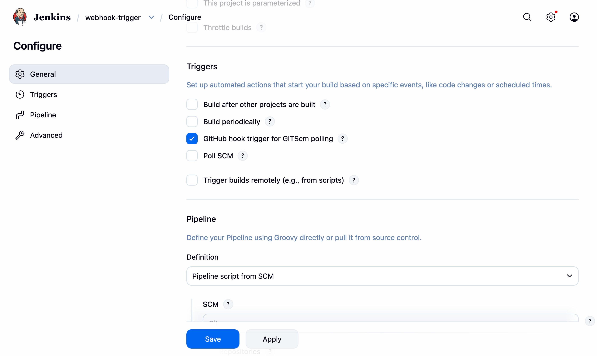
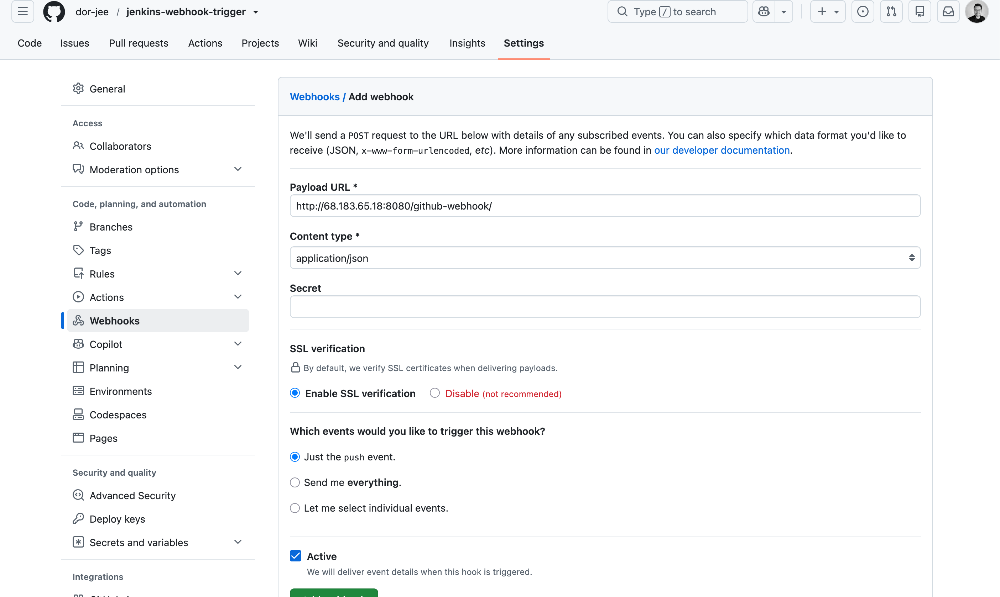
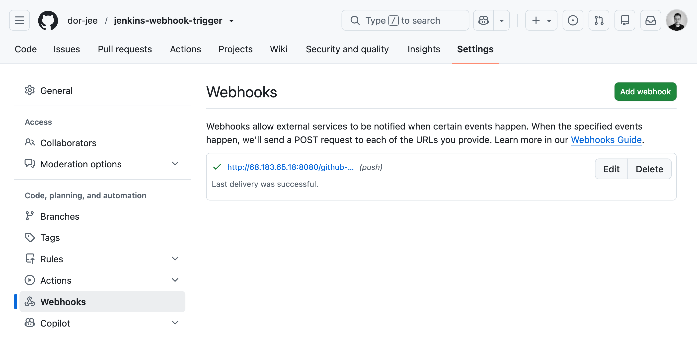
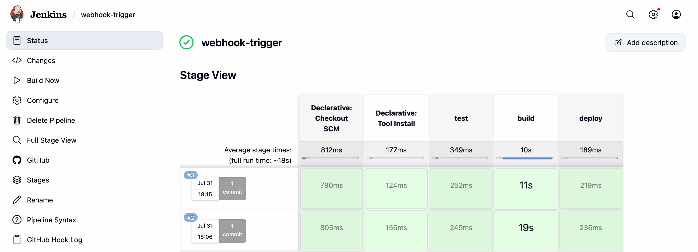
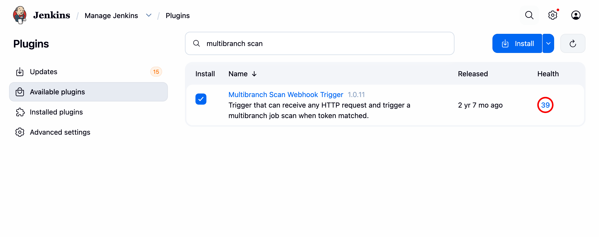
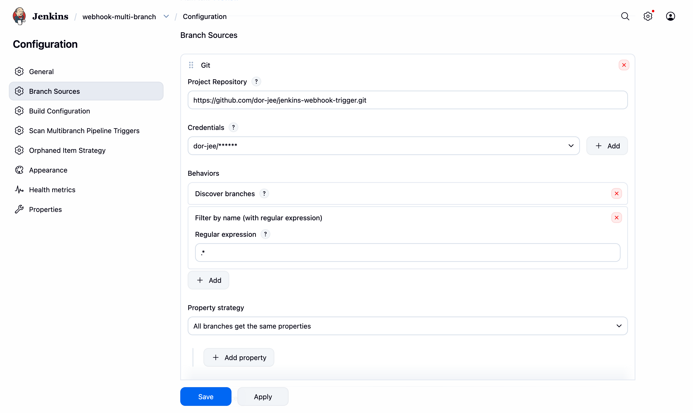
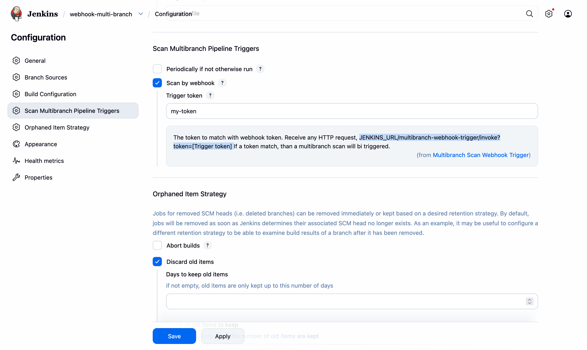
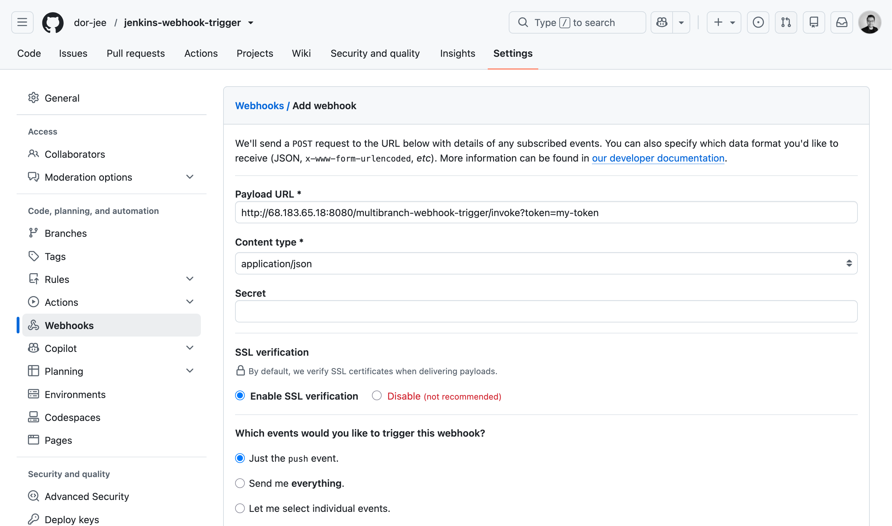
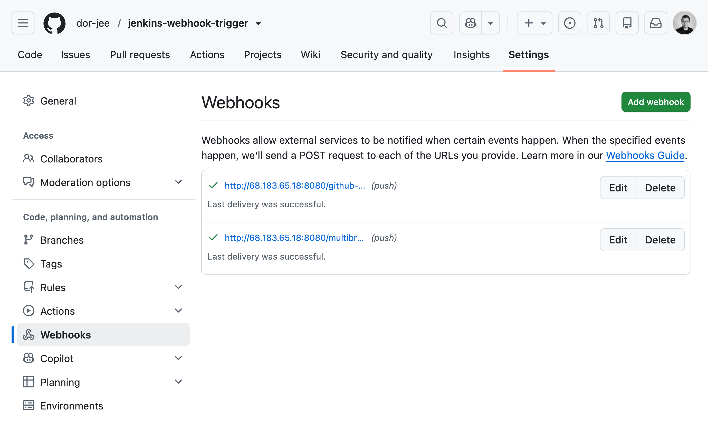
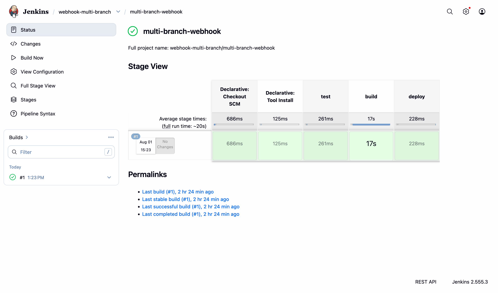

# Jenkins CI Pipeline with Automatic GitHub Webhook Trigger

**Repo:** [jenkins-webhook-trigger](https://github.com/dor-jee/jenkins-webhook-trigger)

## Overview

This project extends a Jenkins CI pipeline for a Java Maven application so that builds are triggered **automatically** whenever code is pushed to GitHub. No more manually clicking "Build Now."

It builds on top of an existing pipeline (originally set up in [jenkins-ci-pipeline-java](https://github.com/dor-jee/jenkins-ci-pipeline-java)) that:
- Builds the Java Maven application
- Builds a Docker image
- Pushes the image to a Docker registry

This repo adds the missing piece: **automatic CI triggering via a GitHub webhook**, covering both a standard **Pipeline job** and a **Multibranch Pipeline** approach.

## Why This Matters

Without a webhook, a CI pipeline is only as good as a developer's habit of remembering to trigger it manually. Real-world CI/CD depends on builds firing automatically the instant code changes — catching failures early, keeping feedback loops tight, and removing a manual step that's easy to forget. This project replicates that real world setup end to end: from Jenkins configuration to GitHub's webhook delivery system, for both single branch and multibranch workflows.

## Prerequisites

- A running Jenkins server (reachable from the public internet, e.g. on a DigitalOcean droplet)
- Docker installed on the Jenkins server/agent
- A GitHub account and repository containing a Java Maven application
- A GitHub Personal Access Token (scope: repo)
- Base pipeline already working: [jenkins-ci-pipeline-java](https://github.com/dor-jee/jenkins-ci-pipeline-java)

## Technologies Used

- Jenkins
- GitHub (Webhooks, GitHub Integration Plugin, Multibranch Scan Webhook Trigger Plugin)
- Docker
- Java / Maven
- Git
- Linux

## Two Approaches

| | Standard Pipeline Job | Multibranch Pipeline |
|---|---|---|
| Trigger mechanism | "GitHub hook trigger for GITScm polling" checkbox | Multibranch Scan Webhook Trigger plugin  |
| What happens on push | Directly triggers a build | Re scans branches, then builds only the branch(es) that changed |
| Best for | A single branch (e.g. `main`) | Repos with multiple active branches / PR-based workflows |
| Source coupling | Uses GitHub's own webhook endpoint (`/github-webhook/`) | Source-agnostic — works with any system that can call an HTTP URL |

## Architecture / Flow

```
Developer pushes code to GitHub
            │
            ▼
   GitHub sends webhook payload
            │
            ├── Standard Pipeline job:
            │     → /github-webhook/ → build triggered directly
            │
            └── Multibranch Pipeline:
                  → /multibranch-webhook-trigger/invoke?token=... 
                  → branches re-scanned
                  → build triggered for the changed branch
            │
            ▼
   Build → Test → Docker Image → Push to Registry
```

---

## Setup — Standard Pipeline Job

### 1. Install the GitHub plugin
Manage Jenkins → Plugins → Available → search "GitHub Integration" → install.


### 2. Add GitHub credentials
Manage Jenkins → Credentials → add a "Username with password" credential, using your GitHub username and a Personal Access Token as the password.


### 3. Configure the Pipeline job
- Pipeline definition: *Pipeline script from SCM*
- SCM: Git, pointing to this repository, using the credentials above
- Build Trigger: enable **"GitHub hook trigger for GITScm polling"**



### 4. Add a webhook on GitHub
Repo → Settings → Webhooks → Add webhook:
- Payload URL: `http://<jenkins-server>:8080/github-webhook/`
- Content type: `application/json`
- Event: `push`




### 5. Verify
Push a commit and confirm GitHub shows a successful delivery, and Jenkins starts a build automatically.



Automatic build triggered





---

## Setup Multibranch Pipeline (Multibranch Scan Webhook Trigger)

### 1. Install the "Multibranch Scan Webhook Trigger" plugin
Manage Jenkins → Plugins → Available → search "Multibranch Scan Webhook Trigger" → install.




### 2. Create the job as a Multibranch Pipeline
New Item → Multibranch Pipeline → Branch Source: GitHub → repo URL + credentials (same PAT as above).




### 3. Enable "Scan by webhook" on the job
Job → Configure → **Scan Multibranch Pipeline Triggers** section → check **"Scan by webhook"** → set a **Trigger token** (e.g. `webhook-trigger`).





### 4. Note the invoke URL
The plugin exposes a fixed endpoint pattern for this job:
```
http://<jenkins-server>:8080/multibranch-webhook-trigger/invoke?token=<your-token>
```

### 5. Point the GitHub webhook at this URL
Repo → Settings → Webhooks → Add webhook:
- Payload URL: `http://<jenkins-server>:8080/multibranch-webhook-trigger/invoke?token=<your-token>`
- Content type: `application/json`
- Event: `push`

GitHub webhook page pointing to the multibranch-webhook-trigger URL





### 6. Verify
Push to any branch and confirm the webhook delivers successfully, Jenkins re-scans the repo, and a build triggers only for the branch that changed.





Automatic build triggered





---

## Related Projects

- [jenkins-ci-pipeline-java](https://github.com/dor-jee/jenkins-ci-pipeline-java) — the base CI pipeline (build, Docker image, push to registry) that this project triggers automatically

## Notes

- This project reuses the same Jenkinsfile and Java/Maven application code as the base CI pipeline project — the focus here is entirely on **Jenkins/GitHub configuration**, not application code changes.
- The Multibranch approach uses the **Multibranch Scan Webhook Trigger** plugin rather than GitHub Branch Source's built-in webhook auto-registration, since it's source-agnostic and doesn't require granting Jenkins `admin:repo_hook` API access.

## Author

**dor-jee**
 — see other projects on [GitHub](https://github.com/dor-jee).
